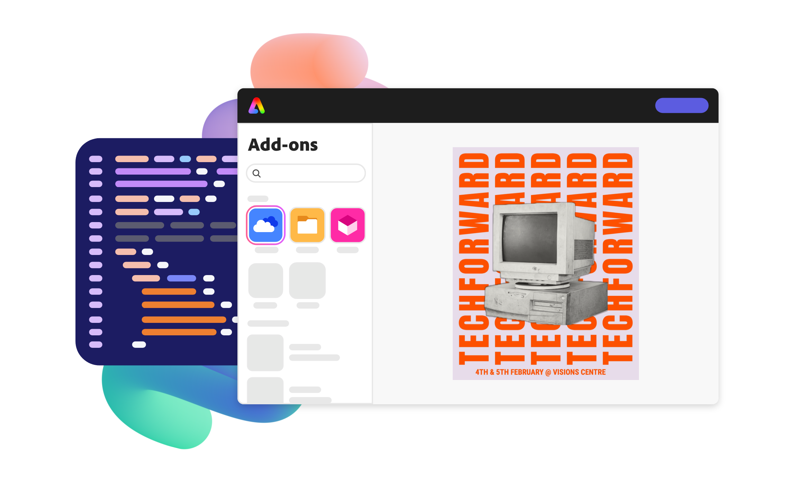

import './styles/main.css'
import CreatorToolBox from "./add-ons/creatorToolBox.md"
import DeveloperToolBox from "./add-ons/developerTool.md"
import bgImg from "./images/Summary_BgImage.jpg"
import img1 from "./images/LogoSDK.png"
import img2 from "./images/change_log.png"
import img3 from "./images/dicord.png"
import img4 from "./images/code.png"

 <Hero slots="heading, text, buttons , assetsImg" customLayout variant="halfwidth" className="add-ones-hero"/>

# Make building add-ons your superpower.

Give users new ways to create and share by building add-ons in Adobe Express.

- [Get started](https://adobe.io)
- [Explore add-ons](https://adobe.io) 

homeheroAssertImage

<TextBlock slots="heading" className="announcement" theme="light"/>

### Expand the creator toolbox.

<WrapperComponent slots="content" repeat="1" theme="light" className="wrapperforCreatorTool"/>

<CreatorToolBox />

<AnnouncementBlock slots="heading, button" className="primaryBtn"/>

### 

[Learn more](https://adobe.io)

<TextBlock slots="heading" className="announcement exploreCapabilities" theme="lightest"/>

### Explore our capabilities.

<TextBlock slots="image, heading,text,buttons" theme="lightest" headerElementType="h2" variantsTypePrimary='secondary' variantStyleFill = "outline" homeZigZag className="zigzag-cta-two explore reverseImage" />

### Leverage familiar web technologies.

Use HTML, CSS, JS/TS, and Spectrum Design libraries to build native-feeling user experiences for your add-on.

- [Learn more](https://adobe.io)

<TextBlock slots="heading,text,image,buttons" theme="lightest" headerElementType="h2" variantsTypePrimary='secondary' variantStyleFill = "outline" homeZigZag className="explore" />

### Connect to other services.

Tap into helper libraries to access secure API endpoints with OAuth 2.0.

- [Learn more](https://adobe.io)

<TextBlock slots="image, heading,text,buttons" theme="lightest" headerElementType="h2" variantsTypePrimary='secondary' variantStyleFill = "outline" homeZigZag className="zigzag-cta-two explore reverseImage" />

### Import from anywhere.

Enable users to drag and drop any image or video asset to a page.

- [Learn more](https://adobe.io)

<TextBlock slots="heading,text,image,buttons" theme="lightest" headerElementType="h2" variantsTypePrimary='secondary' variantStyleFill = "outline" homeZigZag className="explore" />

### Export to everywhere.

Export renditions of your users' work to a variety of formats

- [Learn more](https://adobe.io)

<TextBlock slots="image, heading,text,buttons" theme="lightest" headerElementType="h2" variantsTypePrimary='secondary' variantStyleFill = "outline" homeZigZag className="explore zigzag-cta-two reverseImage" />

### See what's coming.

Define where and how the Adobe Express full editor is launched to ensure users get to the right tools and templates when they need them.

- [Learn more](https://adobe.io)

<TextBlock slots="heading,text" className="announcement exploreCapabilities" theme="light"/>

### Build and share your add-on in no time.

We've got a set of libraries and developers tools to make your job even easier.

<WrapperComponent slots="content" repeat="1" theme="light" className="wrapperforCreatorTool"/>

<DeveloperToolBox />

<TextBlock slots="heading" className="announcement resourceHeader" theme="lightest"/>

### We've got your resources covered.

<TableBlock textColor="#427dcd" resources = {[
        [{ header: "Blog", img: img1, description: "Stay up to date on platform release, best practices, and more." },
        { header: "Changelog", img: img2, description: "Read up on the latest changes." }],
        [{ header: "Discord", img: img3, description: "Join our active community of developers." },
        { header: "Samples", img: img4, description: "Get started quickly - access common patterns with our collections of code samples" }]
]}/>

<TeaserBlock  slots="heading,text,buttons" textColor="white" bgURL={bgImg} className="viewAddOn" variant="fullwidth"/> 

### It's go time.

View our developer quickstart guide to start building add-ons in Adobe Express.

- [View the guide](../guides/)
- [Try an add-on](../guides/)

