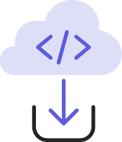

<TextBlock slots="image, text" width="33%" theme="light" className="developerTool" />

[Use the CLI](https://developer.adobe.com/express/add-ons/docs/guides/getting_started/quickstart/) to start building with templates.

<TextBlock slots="image, text" width="33%"  theme="light" className="developerTool" />

Test and debug your add-on with [these developer tools](https://developer.adobe.com/express/add-ons/docs/guides/debug/).

<TextBlock slots="image, text" width="33%"  theme="light" className="developerTool" />

[Package and submit](https://developer.adobe.com/express/add-ons/docs/guides/distribute/) your add-on to the marketplace.
