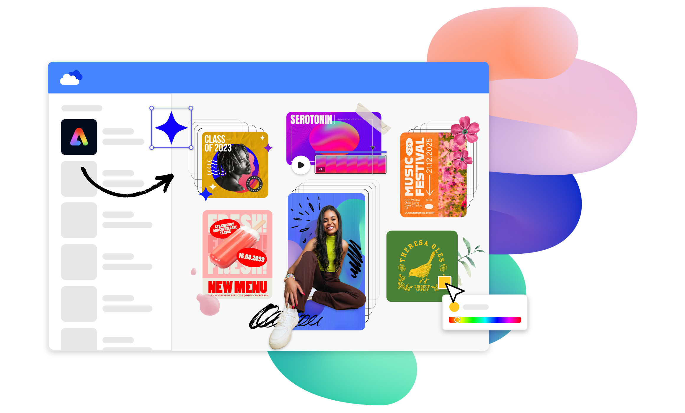

import './styles/main.css'
import CreatorToolBox from "./add-ons/creatorToolBox.md"
import DeveloperToolBox from "./add-ons/developerTool.md"
import SpaceContent from './add-ons/spaceAbility.md'
import LearnMoreBtn from "./add-ons/learnmore.md"
import bgImg from "./images/Summary_BgImage.jpg"
import heroVideo from "./videos/R2_Add-on.mp4"

<!-- <Hero slots="heading, text, buttons, assetsImg" customLayout variant="video" animationVideo={heroVideo} className="homeherobgImage Hero-Banner"/> -->
<Hero slots="heading, text, buttons" variant="halfwidth" videoUrl={heroVideo} className="add-ones-hero" />

## Build add-ons for a global creative community.

[Adobe Express](https://adobe.com/express) is an AI-first all-in-one app to easily create and share standout content. Make tools and integrations for users that extend the functionality of Adobe Express.

- [Get started](https://developer.adobe.com/express/add-ons/docs/guides)
- [Explore add-ons](https://new.express.adobe.com/add-ons)

<TextBlock slots="heading" className="announcement" theme="light"/>

### Create powerful solutions for millions of users.

<WrapperComponent slots="content" repeat="1" theme="light" className="wrapperforCreatorTool"/>

<CreatorToolBox />

<WrapperComponent slots="content" repeat="1" theme="light" className="learnMoreWrapper"/>

<LearnMoreBtn />

<TextBlock slots="heading" className="announcement" theme="lightest"/>

### Built by our community.

<SpaceContent />

<TeaserBlock  slots="buttons" className="secondaryBtn"/>

- [Explore more](https://new.express.adobe.com/add-ons)

<TextBlock slots="heading" className="announcement exploreCapabilities" theme="lightest"/>

### Explore our capabilities.

<TextBlock slots="image, heading,text,buttons" theme="lightest" headerElementType="h2" variantsTypePrimary='secondary' variantStyleFill = "outline" homeZigZag className="explore" position="right"/>

### Leverage familiar web technologies.

Use HTML, CSS, JavaScript/TypeScript, and [Spectrum](https://developer.adobe.com/express/add-ons/docs/guides/build/design/) to build native-feeling user experiences for your add-on.

- [Learn more](https://developer.adobe.com/express/add-ons/docs/guides/build/advanced-topics/frameworks-libraries-bundling/)

<TextBlock slots="heading,text,image,buttons" theme="lightest" headerElementType="h2" variantsTypePrimary='secondary' variantStyleFill = "outline" homeZigZag className="explore" position="left" />

### Connect to other services.

Tap into helper libraries to access secure API endpoints with OAuth 2.0.

- [Learn more](https://developer.adobe.com/express/add-ons/docs/guides/learn/how_to/oauth2/)

<TextBlock slots="image, heading,text,buttons" theme="lightest" headerElementType="h2" variantsTypePrimary='secondary' variantStyleFill = "outline" homeZigZag className="explore" position="right" />

### Import content from anywhere.

Enable users to drag and drop any image or video asset to a document.

- [Learn more](https://developer.adobe.com/express/add-ons/docs/guides/learn/how_to/drag_and_drop/)

<TextBlock slots="heading,text,image,buttons" theme="lightest" headerElementType="h2" variantsTypePrimary='secondary' variantStyleFill = "outline" homeZigZag className="explore" position="left"/>

### Export your content everywhere.

Export renditions of your users' work to a variety of formats.

- [Learn more](https://developer.adobe.com/express/add-ons/docs/guides/learn/how_to/create_renditions/)

<TextBlock slots="image,heading,text,buttons" theme="lightest" headerElementType="h2" variantsTypePrimary='secondary' variantStyleFill = "outline" homeZigZag className="explore" position="right" />

### Transform Adobe Express user documents

Get deep access to a user’s active document to add rich data visualizations, generate variations from data, and more.

- [Learn more](https://developer.adobe.com/express/add-ons/docs/guides/learn/how_to/use_text/)

<TextBlock slots="heading,text" className="announcement exploreCapabilities" theme="light"/>

### Build and share your add-on in no time.

We’ve got a set of libraries and developer tools to make your job even easier.

<WrapperComponent slots="content" repeat="1" theme="light" className="wrapperforCreatorTool"/>

<DeveloperToolBox />

<TextBlock slots="heading" className="announcement resourceHeader" theme="lightest"/>

### We've got your resources covered.

<MiniResourceCard slots="image,heading,link" repeat="3" theme="lightest" inRow="3" className="mini-card support-tools" />

### Blog

[Link to blog post](https://blog.developer.adobe.com/en/topics/adobe-express-add-ons)

### Code samples

[Link to code samples](https://developer.adobe.com/express/add-ons/docs/guides/learn/samples/)

### Changelog

[Link to changelog](https://developer.adobe.com/express/add-ons/docs/guides/getting_started/changelog/)

<TeaserBlock  slots="heading,text,buttons" textColor="white" bgURL={bgImg} className="viewAddOn" variant="fullwidth"/>

Apply to the Adobe Fund for Design

Get funding to build Adobe Express add-ons.

- [Apply now](https://developer.adobe.com/fund-for-design)
