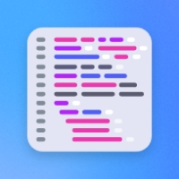

import './styles/main.css'
import CreatorToolBox from "./add-ons/creatorToolBox.md"
import DeveloperToolBox from "./add-ons/developerTool.md"
import LearnMoreBtn from "./add-ons/learnmore.md"
import bgImg from "./images/Summary_BgImage.jpg"

<Hero slots="heading, text, buttons, assetsImg" customLayout variant="halfwidth" className="add-ones-hero"/>

## Make building add-ons your superpower.

Give users new ways to create and share by building add-ons in <a href="https://new.express.adobe.com">Adobe Express</a>.

- [Get started](https://developer.adobe.com/express-add-ons/docs/guides)
- [Explore add-ons](https://new.express.adobe.com/new?category=addOns&addOnId=)

homeheroAssertImage

<TextBlock slots="heading" className="announcement" theme="light"/>

### Expand the creator toolbox.

<WrapperComponent slots="content" repeat="1" theme="light" className="wrapperforCreatorTool"/>

<CreatorToolBox />

<WrapperComponent slots="content" repeat="1" theme="light" className="learnMoreWrapper"/>

<LearnMoreBtn />

<TextBlock slots="heading" className="announcement exploreCapabilities" theme="lightest"/>

### Explore our capabilities.

<TextBlock slots="image, heading,text,buttons" theme="lightest" headerElementType="h2" variantsTypePrimary='secondary' variantStyleFill = "outline" homeZigZag className="explore" position="right"/>

### Leverage familiar web technologies.

Use HTML, CSS, JavaScript/TypeScript, and [Spectrum](https://spectrum.adobe.com/) to build native-feeling user experiences for your add-on.

- [Learn more](https://adobe.io)

<TextBlock slots="heading,text,image,buttons" theme="lightest" headerElementType="h2" variantsTypePrimary='secondary' variantStyleFill = "outline" homeZigZag className="explore" position="left" />

### Connect to other services.

Tap into helper libraries to access secure API endpoints with OAuth 2.0.

- [Learn more](https://adobe.io)

<TextBlock slots="image, heading,text,buttons" theme="lightest" headerElementType="h2" variantsTypePrimary='secondary' variantStyleFill = "outline" homeZigZag className="explore" position="right" />

### Import from anywhere.

Enable users to drag and drop any image or video asset to a document.

- [Learn more](https://adobe.io)

<TextBlock slots="heading,text,image,buttons" theme="lightest" headerElementType="h2" variantsTypePrimary='secondary' variantStyleFill = "outline" homeZigZag className="explore" position="left"/>

### Export to everywhere.

Export renditions of your users' work to a variety of formats.

- [Learn more](https://adobe.io)

<TextBlock slots="image, heading,text" theme="lightest" headerElementType="h2" variantsTypePrimary='secondary' variantStyleFill = "outline" homeZigZag className="explore" position="right" />

### More in the works.

Powerful new APIs are right around the corner.

<TextBlock slots="heading,text" className="announcement exploreCapabilities" theme="light"/>

### Build and share your add-on in no time.

We’ve got a set of libraries and developer tools to make your job even easier.

<WrapperComponent slots="content" repeat="1" theme="light" className="wrapperforCreatorTool"/>

<DeveloperToolBox />

<TextBlock slots="heading" className="announcement resourceHeader" theme="lightest"/>

### We've got your resources covered.

<MiniResourceCard slots="image,heading" repeat="3" theme="lightest" inRow="3" className="mini-card" />

### Blog

### Code samples

### Changelog

<TeaserBlock  slots="heading,text,buttons" textColor="white" bgURL={bgImg} className="viewAddOn" variant="fullwidth"/>

It's go time.

View our developer quickstart guide to start building add-ons in Adobe Express.

- [View the guide](https://adobe.io)
- [Try an add-on](https://new.express.adobe.com/new?category=addOns&addOnId=)
