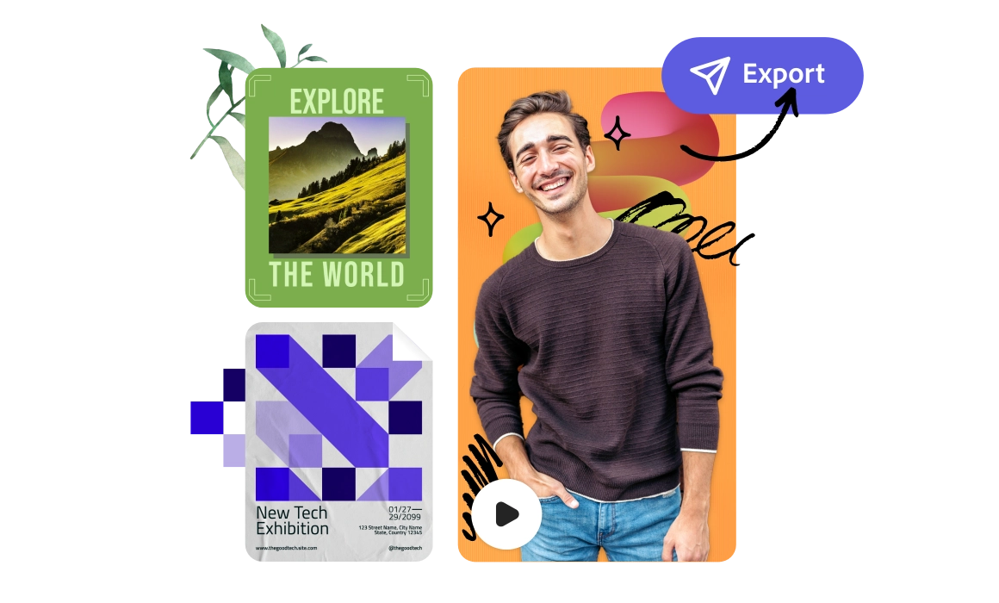

import '../styles/main.css';
import ToolBar from "./toolbar.md";
import GetAnOverview from "./get-an-overview.md";
import bgImg from "../images/Summary_BgImage.jpg";
import heroVideo from "../videos/R2_Add-on_why-build.mp4"

<Hero slots="heading, text, buttons" variant="halfwidth" className="add-ones-hero why-build" videoUrl={heroVideo} />

## Build add-ons for Adobe Express

The quick and easy create-anything app. Make social posts, images, videos, flyers, and more starting from thousands of templates. Create fast with generative AI and stay on brand with one-click edits.

- [Explore add-ons](https://developer-stage.adobe.com/express/add-ons/trending/)
- [Learn more](https://adobe.com/express)

<TextBlock slots="heading" className="announcement" theme="light"/>

### Explore our capabilities

<WrapperComponent slots="content" repeat="1" theme="light" className="wrapperforCreatorTool"/>

<ToolBar />

<WrapperComponent slots="content" repeat="1" theme="light" className="learnMoreWrapper"/>

<GetAnOverview />

<TextBlock slots="heading,text,image,buttons" theme="lightest" headerElementType="h2" variantsTypePrimary='secondary' variantStyleFill = "outline" homeZigZag className="explore" position="left" />

### Get your idea funded

Unlock the potential of your ideas with the Adobe Fund for Design. We're empowering builders like you to innovate on our developer platform. With targeted use cases to explore, now’s the time to build.

- [Learn more](https://developer.adobe.com/fund-for-design/)

<TextBlock slots="heading, text" className="start-up"/>

### “As a small startup, the fund’s support was very meaningful in bringing our product to a larger audience through Adobe Express. Our add-on enables the creation of AI Animated, talking 3D Avatars which can be used in lesson plans, social media posts and more.”

Jhanvi Shriram, CEO at [Krikey AI Animation](https://www.krikey.ai/)

<TeaserBlock  slots="heading,buttons" textColor="white" className="viewAddOn build-add-ons" variant="fullwidth"/>

Build add-ons for Adobe Express

- [Get started](https://developer.adobe.com/express/add-ons/docs/guides/)
